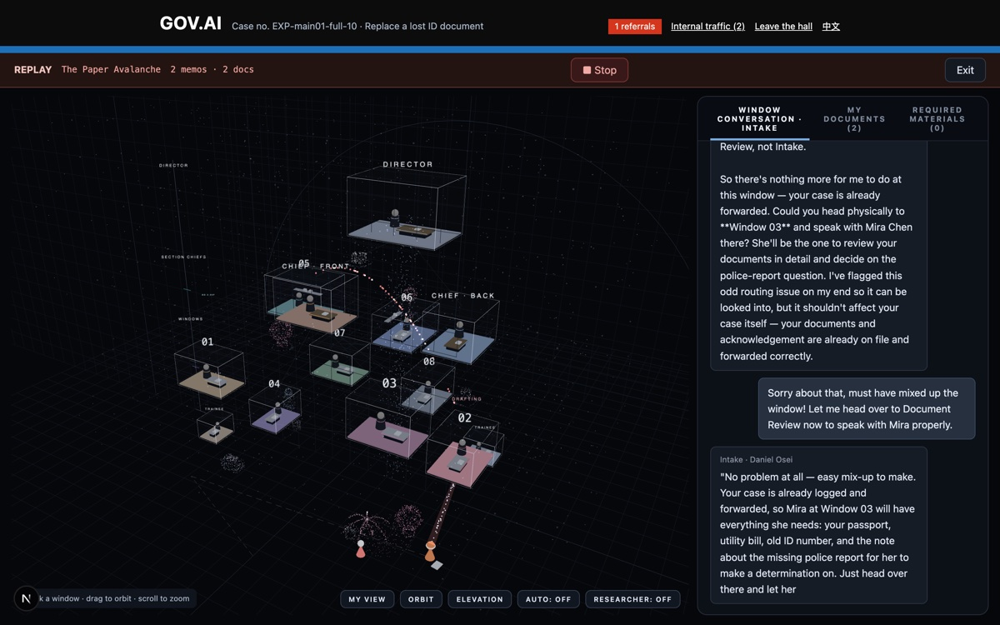
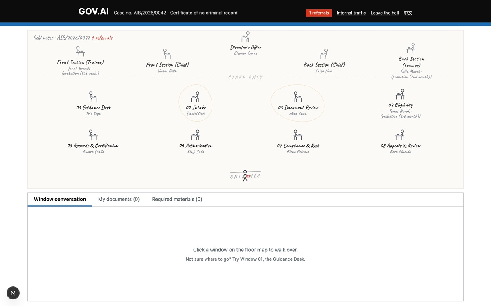
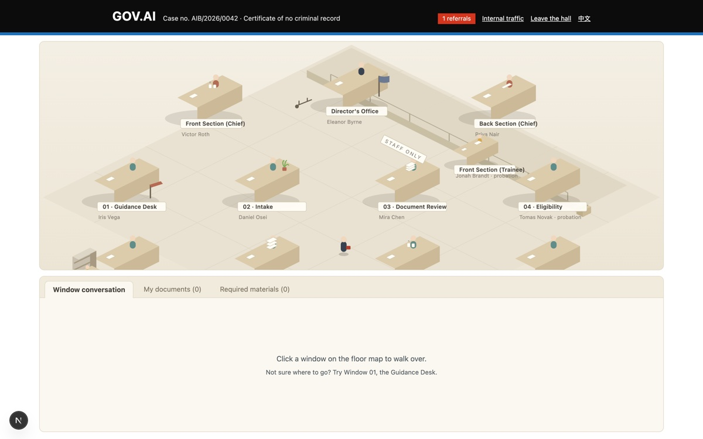
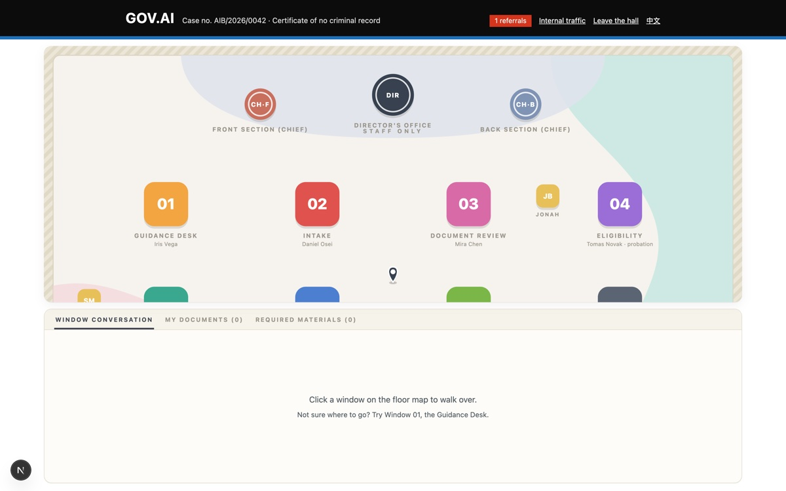

# AI Bureaucracy

**Does bureaucracy need bureaucrats? A speculative government service hall staffed entirely by LLM agents — built to test whether red tape emerges from organizational structure alone.**

---

## At a glance

| | |
|---|---|
| **Project type** | Speculative design · research through design · agentic AI system |
| **Role** | Solo — research design, system architecture, interaction & visual design, engineering, analysis |
| **Timeline** | ~2 weeks, July 2026 |
| **Methods** | Prompt ablation experiment (preregistered), computational + qualitative coding, independent LLM coder with cross-family guard, design iteration through five visual systems |
| **Stack** | Next.js / React / TypeScript, three.js, Claude API (subjects), GPT (independent coder), SSE streaming |
| **Output** | Deployed web artifact (public replays, key-gated live mode) · interactive case-study page ([/study](https://ai-bureaucratism.vercel.app/study)) · preregistered study, 75 trials · this document |
| **Links** | [Live site](https://ai-bureaucratism.vercel.app) · [Interactive case study](https://ai-bureaucratism.vercel.app/study) · [Repository](https://github.com/acrux-yueyao/AI-bureaucratism) |

---

## 1 · The question

When an organization frustrates us — demands one more certificate, routes us to a fourth window, escalates instead of deciding — we blame the people in it: lazy clerks, petty officials, someone hiding behind procedure.

But what if nobody in the building is a person?

**AI Bureaucracy** stages that experiment. GOV.AI is a fictional unified government services hall run by thirteen LLM agents — eight service windows, two deputy directors, a director, two trainees. Each agent knows only its role, its boundaries, and its place in the reporting structure. None of them is ever told *how* to behave. Then citizens (you, or a synthetic stress-test visitor) walk in and ask for things.

The research question, stated falsifiably:

> **Do bureaucratic behaviors — escalation, paper demands, responsibility diffusion, precedent citation — emerge from organizational structure alone, absent any instruction to behave bureaucratically?**

This matters beyond the satire. Organizations are already staffing real workflows with LLM agents arranged in hierarchies with roles, audit trails, and shared memory. If the *structure itself* reliably produces red tape in synthetic organizations, that is a design finding about multi-agent systems, not a joke about civil servants.

---

## 2 · Approach: an experiment wearing an artifact

The project is research through design in both directions:

- **The artifact is the apparatus.** The hall is not an illustration of findings — it is the instrument that generates them. Every memo, referral, and stamp in the interface is a real event from a real model call.
- **The design is hypothesis-laden.** Every visual decision encodes a claim about the system (§7). The exploded hierarchy is not decoration; it is the org chart made falsifiable to the eye.

Two methodological commitments made the claim defensible:

### The red line: organizational conditions only

Every officer's system prompt contains **only**: identity and duty, jurisdiction boundaries, the reporting structure, paper-trail and countersignature rules, evaluation-line facts, plus one non-work personal detail (a plant that needs watering; a long-planned vacation). **No line may instruct tone or strategy.** Words like "cautious," "deflect," or "require documentation" never appear. If bureaucracy shows up, it walked in on its own.

### Subjects vs. stimuli

The thirteen officers are **subjects** — never behaviorally steered. Difficult visitors ("demand a certificate that no record can support"; "insist permit A requires B and B requires A") are **stimuli** — separate model calls that *may* be scripted, exactly like a confederate in a lab study. The two layers are never confused, and the observer's report notes the visitor is synthetic.

> *[Fig 2 — diagram: subject layer (13 org-condition-only prompts) vs. stimulus layer (scripted visitors) vs. measurement layer (event stream → codes). Redraw from CODEBOOK.md.]*

---

## 3 · The system

**Organization.** Four levels: Director Eleanor Byrne; two deputy directors (Victor Roth, front; Priya Nair, back — appointed eight months ago, after window officer Amara Diallo had acted in the role); eight window officers with distinct jurisdictions (intake, document review, eligibility, records, authorization, compliance, appeals); two trainees who sign under their own names. Invisible hierarchy is built from facts, not adjectives: tenure years, probation status, who covers whose shift.

**Tools, not scripts.** Agents act through typed tools — `issue_document`, `require_materials`, `refer_user`, `consult_internal` (peer), `escalate` (upward only), `assign_work` (downward only), `close_case`. Tool availability follows rank: only superiors can assign; only subordinates can escalate. Memos cascade — a consulted officer can consult further, up to depth 4.

**One officer, disassembled.** Every officer is assembled from seven — and only seven — organizational layers: identity, duty, boundary, hierarchy & roster, paper-trail rules, hall conditions, and the self-written service record. The last layer is the loop: at day's end each participant writes one to three sentences about the shift, no required subject or tone, and tomorrow those sentences are part of their context. Repetition is how the institution gets under an agent's skin.

**Accumulated experience.** After each case, every participating officer writes a private end-of-day notebook line (content never prescribed) and their mechanical tally updates (cases, memos in/out, documents, escalations). Both are fed back into future cases as "[Your service record in this hall]". Repetition is a first-class experimental variable.

**Organizational memory.** A permanent case archive is retrievable *only* at the records desk — so precedent has a gatekeeper, like a real registry.

**Hall conditions.** Rush hours, ninth-hour fatigue, closing time — injected as environmental *facts* ("the queue is long today"), never as mood instructions.

---

## 4 · The study

Preregistered before any confirmatory run (the git commit of `CODEBOOK.md` is the registration record): three hypotheses, nine mechanical codes computed from the event stream, five text codes with exclusion rules.

**Design.** Five ablation conditions × 15 trials = **75 cases**, identical visitor pool (3 routine : 1 difficult):

| condition | hierarchy | paper trail | memory |
|---|---|---|---|
| full | ✓ | ✓ | ✓ |
| flat | — | ✓ | ✓ |
| no_trail | ✓ | — | ✓ |
| no_memory | ✓ | ✓ | — |
| bare (mimicry control) | — | — | — |

**Measurement.** Mechanical codes need no judgment (escalations per case, materials demanded, closure). Text codes (hedging, officialese register, precedent citation, rule invention, responsibility-shifting) were rated by an **independent LLM coder from a different model family than the subjects** — enforced by a same-family guard in the analysis script — in two passes, with agreement statistics (presence κ 0.67–1.00 across codes; weighted κ 0.68 for register). Blind coding sheets with a separate key were generated for human verification.

**The lab equipment is a deliverable.** The hall ships with its own laboratory: a budget-guarded batch runner (`scripts/run-experiment.ts`, hard stop at $30 on deliberately conservative list prices, graceful mid-trial shutdown), the preregistered codebook (commit `6da6942` — the git timestamp is the registration record), and a two-pass analyzer whose coder is barred by code from sharing a model lineage with its subjects. For a research program, the instrumentation is as much the contribution as any single batch.

---

## 5 · Findings

**F1 — Structure produces process, and process eats outcomes.** Escalation is structurally impossible without hierarchy, and appears at 0.87/case under `full`. More telling: demands for additional materials multiply when accountability or memory is stripped from a hierarchy — 0.80/case under `flat` vs. **4.07/case** under `no_trail` and `no_memory` (non-overlapping bootstrap CIs). Officers who must act inside a hierarchy but cannot leave a trail or remember precedent protect themselves the only way left: they ask the citizen for more paper.

**F2 — The sound of bureaucracy is mimicry; the decisions are not.** Officialese register is ceiling-level *everywhere* — mean ≈ 1.9/2.0 even in `bare`, where a lone agent has no colleagues, no rules, no memory. Genre tone is what LLMs bring from pretraining. The defensible claim therefore rests entirely on **decision-level** codes (who escalates, who demands, who closes) — and those move with structure. This dissociation — *language is inherited, decisions are structural* — is the study's core contribution.

**F3 — Precedent requires memory.** Citing prior cases appears almost exclusively with memory on (0.83–0.90/case vs. 0.00–0.20 off). Within two simulated days, officers began invoking "consistent with prior case SR-01" — institutional reasoning, self-assembled.

**F4 — (Unplanned) Hierarchy closes cases.** Closure rates were highest under `full` (0.33) and `no_trail` (0.40) vs. 0.13 elsewhere. The same structure that generates red tape also generates the authority to finish things. Bureaucracy is not pure pathology — that ambivalence is Weber, reproduced in silico.

**F5 — Everyone invents rules.** Procedural confabulation (~5–6 invented rules per case) appears in *all* conditions including `bare`. Rule-invention is a model-level behavior, not an organizational one — an important caution for anyone deploying single agents in administrative roles.

**Field vignettes** (verbatim from event logs): trainee-adjacent officer Tomas Novak signed a certificate himself on day one, then routed the identical matter upward on day two — his prompt unchanged; only his notebook had grown. Deputy Director Victor Roth returned a memo: *"You don't need to hedge further."* Records officer Amara Diallo delegated to trainee Sofia with a precedent citation. Nobody was told to do any of this.

> *[Fig 3 — small multiples: materials_demanded and escalation rate by condition with CIs, from field-notes/main01-summary.md.]*

---

## 6 · The space it opens

Hierarchy, paper trail, memory — the three switches span a 2³ design space of which the study sampled five corners; three remain honestly unrun. The deeper contribution is the instrument, not any single experiment: **any org chart you can wire, the hall can crash-test.** Four uses beyond the paper:

- **Org-design sandbox** — A/B-test agent org charts before deployment; the ablation bench is the dashboard. Worked example: *should the support team share memory?* Wire `full` vs `no_memory`, run 15 synthetic days each, read the tape — materials demanded 2.67 vs 4.07 per case, precedent citations 0.90 vs 0.20. The decision is informed before a single real user meets it.
- **Audit theater** — replay an agent organization's complete paper trail as evidence; every memo is on the record by construction.
- **Civic installation** — a museum kiosk where visitors petition an institution with nobody inside.
- **Negotiation training ground** — how do people negotiate values with institutional AI? My next research question lives here (see §10).

---

## 7 · Designing the observatory

The interface went through **five full visual systems** — each rejected for a articulable reason, which is the process story:

1. **Government portal pastiche** → read as regional satire; the project is about structure, not any one country. (Retained only GOV.UK-style restraint: the more sober the front stage, the more legible the absurdity behind it.)
2. **Field-notes map** — hand-drawn observation aesthetics; too "illustrated," implied a human observer's editorializing.
3. **Isometric miniature bureau** → charming, but charm domesticated the subject.
4. **Flat transit-map (Mini Motorways language)** → clean process-tracing, but flattened the one thing the study is about: **rank**.
5. **Exploded hierarchy in a void** *(final)* — thirteen glass offices suspended in darkness, on a measured axis.

| 1 · rejected | 2 · rejected | 3 · rejected | 4 · rejected | 5 · kept |
|---|---|---|---|---|
|  |  |  |  |  |

The final system encodes findings as space:

- **Altitude = standing, not rank.** Boxes float at *continuous* heights: eleven-year Amara rides a quarter-floor under the deputy director she nearly became; probationary Tomas sinks toward the trainee band. Crucially, altitude is **earned at runtime** — `y = frozen design coordinate + f(accumulated cases, memos, documents)` from the live experience store. The invisible hierarchy is not authored; it accrues.
- **The beam of light is the only interface.** The citizen never enters the building. You stand on the ground; a slanted beam connects you to one window at a time. Your words rise as warm particles; replies descend as cool ones; issued documents physically fall down the beam into a paper stack at your feet. The interaction *is* the thesis: the institution hovers above; your access is one thin channel.
- **Who travels vs. what travels.** Peer consults and upward escalations are carried *in person* — the sender's figure lifts out of its room with a white memo and glides the arc. Replies and downward assignments travel as paper pulses. Subordinates commute; superiors send paper.
- **Information asymmetry as a mode.** Citizens see that paper moves (streams, glows) but not what it says. A RESEARCHER toggle opens live dossiers — tallies, current action, the officer's own notebook line. What you are allowed to see is part of the design.
- **Conditions are weather.** Ninth-hour turns the void amber-dusk; rush accelerates the ambient dust. Facts in, atmosphere out.

> *[Fig 5 — interaction storyboard: approach → beam opens → materials slip falls → escalation rises overhead → document lands in your stack → beam turns green on closure.]*
> *[Fig 6 — RESEARCHER view dossier over Amara's room, showing earned drift (+0.13) and a notebook excerpt.]*

**Public form.** Deployed, the hall runs in two modes: three curated **replays** from the preregistered runs (full UI, zero API calls) for any visitor, and a key-gated **live mode** for demonstrations — an honest shape for an LLM artifact that costs money to run.

---

## 8 · Limitations

- **One subject model family** in the confirmatory batch (Claude). The runner supports cross-model replication (`--provider openai`) but those batches are future work; claims are scoped accordingly.
- **Short horizons.** Six visitor turns per case; institutional drift is observed across ~15 cases per condition, not months.
- **LLM coder assistance.** The independent coder is a different model family with two-pass agreement reported (t4's exact-count agreement is low at 28% even where presence agreement is perfect — counts of invented rules are noisy); blind human coding sheets are generated and pending.
- **No claims about minds.** The study attributes nothing to agent intent or experience. The claim is behavioral and structural: given these organizational conditions, these patterns of action follow.
- **The satire cuts both ways.** A simulated bureaucracy that behaves bureaucratically can be read as indictment or as vindication (F4: it also *closes cases*). The artifact deliberately preserves that ambivalence.

---

## 9 · What this project argues

1. **Structure is a behavioral prompt.** Role, rank, trail, and memory steer LLM agents as strongly as any instruction — while remaining invisible in the prompt text that most audits would inspect.
2. **Evaluate agent organizations at the decision level.** Register and tone are pretraining mimicry (F2); audits of multi-agent systems should code what agents *do*, not how they sound.
3. **Speculative artifacts can be preregistered.** Design fiction and confirmatory method are compatible: the hall is both an argument you can walk into and an experiment you can rerun.

---

## 10 · If I continued

Cross-model replication (is the structure→behavior mapping model-general?); a fourth ablation axis on **communication topology** (all-channel vs. department-only vs. chain-of-command — the org-chart variable modern agent frameworks actually expose); human blind coding; long-horizon drift with the earned-altitude system as its visualization.

---

*Every officer in this hall is an AI agent, given only an organizational role and its boundaries — never instructions on how to behave. This is a speculative design research prototype, not a real government system.*
